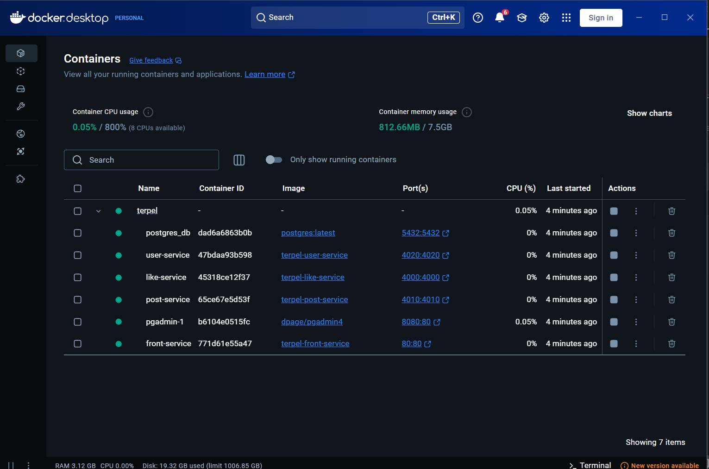

# social-network

## Compose sample application
### React application with a NodeJS backend and a MySQL database

Project structure:
```
.
├── Backend
│   ├── ...
│   ├── Dockerfile
├── Frontend
│   ├── ...
│   └── Dockerfile
├── .gitignore
├── docker-compose.yaml
├── initdb.sh
└── README.md
```

(docker-compose.yaml)
```
services:
  postgres:
    image: postgres:latest
    ports:
      - "5432:5432"
    ...
  pgadmin:
    image: dpage/pgadmin4
    ports:
      - "8080:80"
    ...
  user-service:
    build: ./Backend/
    ports:
      - "4020:4020"
    ...
  post-service:
    build: ./Backend/
    ports:
      - "4010:4010"
  like-service:
    build: ./Backend/
    ports:
      - "4000:4000"
```
The compose file defines an application with six services `postgres`, `pgadmin`, `user-service`, `post-service`, `like-service` and `front-service`.

When deploying the application, docker compose maps port 3000 of the frontend service container to port 3000 of the host as specified in the file.
Make sure port 3000 on the host is not already being in use.


## Deploy with docker compose

```
$ docker-compose up -d
[+] Running 7/7
 ✔ Network terpel_default      Created                                                                                                                              0.1s 
 ✔ Container postgres_db       Started                                                                                                                              2.2s 
 ✔ Container terpel-pgadmin-1  Started                                                                                                                              2.5s 
 ✔ Container user-service      Started                                                                                                                              2.7s 
 ✔ Container post-service      Started                                                                                                                              2.8s 
 ✔ Container like-service      Started                                                                                                                              2.7s 
 ✔ Container front-service     Started
```

## Expected result

Listing containers must show containers running and the port mapping as below:
```
$ docker ps
CONTAINER ID        IMAGE                          COMMAND                  CREATED             STATUS                   PORTS                                                  NAMES
f3e1183e709e        react-express-mysql_frontend   "docker-entrypoint.s…"   8 minutes ago       Up 8 minutes             0.0.0.0:3000->3000/tcp                                 react-express-mysql_frontend_1
9422da53da76        react-express-mysql_backend    "docker-entrypoint.s…"   8 minutes ago       Up 8 minutes (healthy)   0.0.0.0:80->80/tcp, 0.0.0.0:9229-9230->9229-9230/tcp   react-express-mysql_backend_1
a434bce6d2be        mysql:8.0.19                   "docker-entrypoint.s…"   8 minutes ago       Up 8 minutes             3306/tcp, 33060/tcp                                    react-express-mysql_db_1
```

After the application starts, navigate to `http://localhost:3000` in your web browser.




The backend service container has the port 80 mapped to 80 on the host.
```
$ curl localhost:80
{"message":"Hello from MySQL 8.0.19"}
```

Stop and remove the containers
```
$ docker compose down
Stopping react-express-mysql_frontend_1 ... done
Stopping react-express-mysql_backend_1  ... done
Stopping react-express-mysql_db_1       ... done
Removing react-express-mysql_frontend_1 ... done
Removing react-express-mysql_backend_1  ... done
Removing react-express-mysql_db_1       ... done
Removing network react-express-mysql_default

```